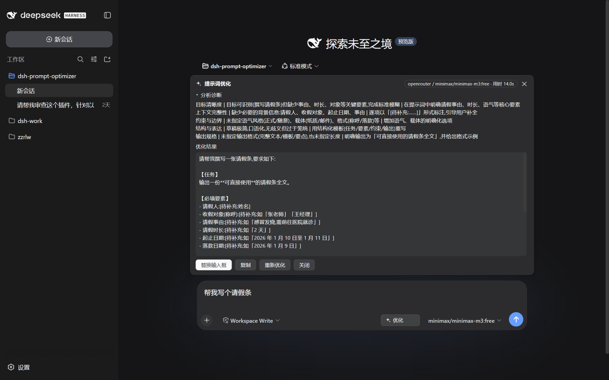
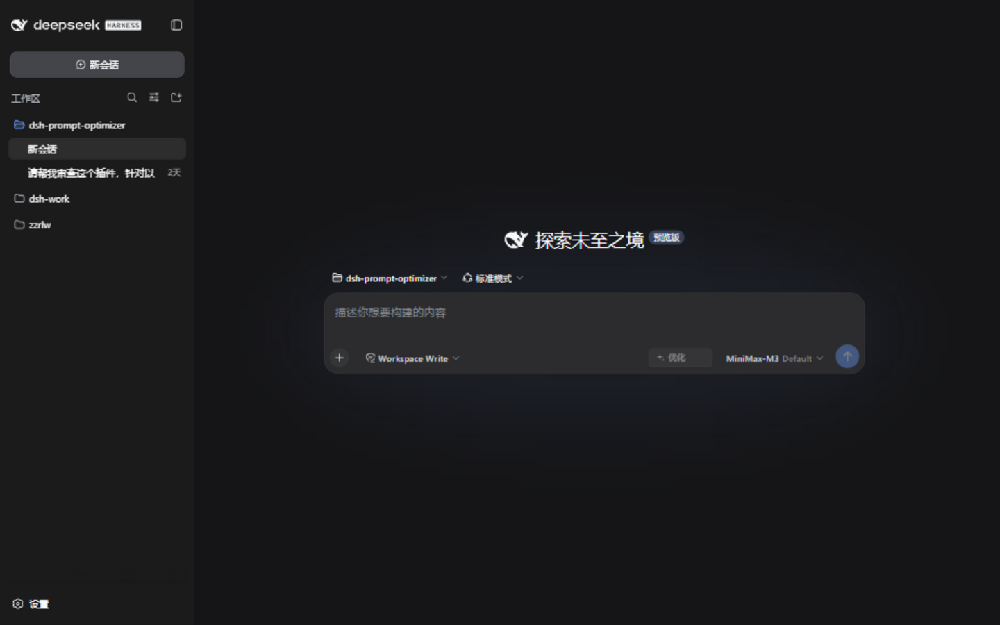
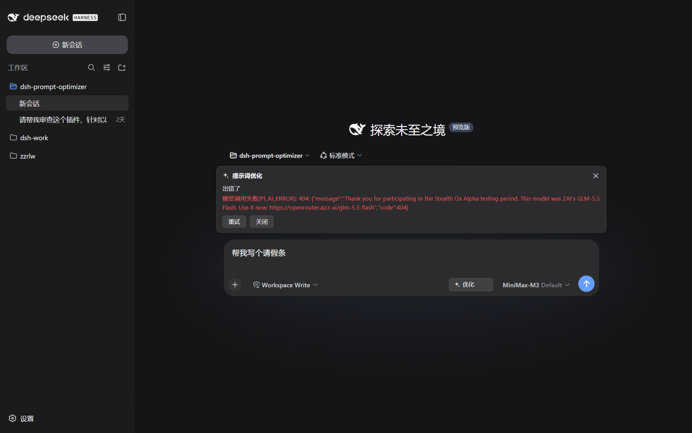
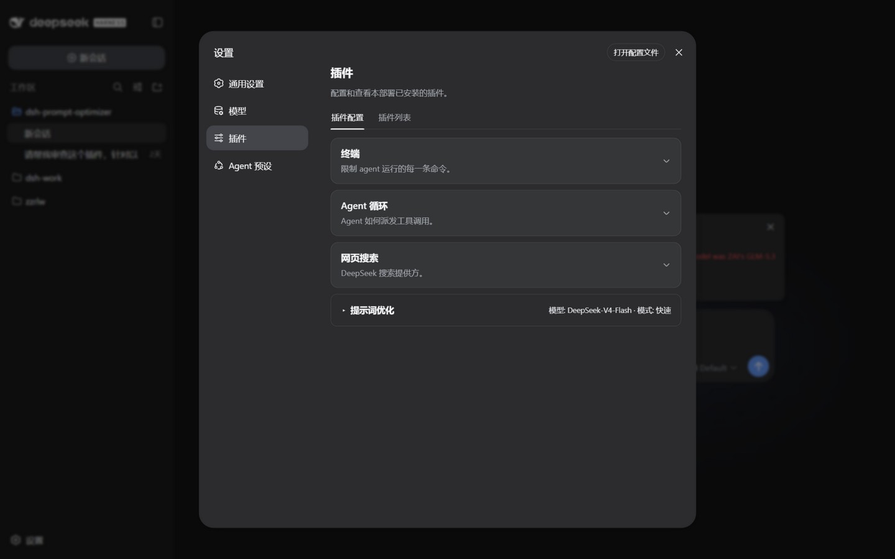
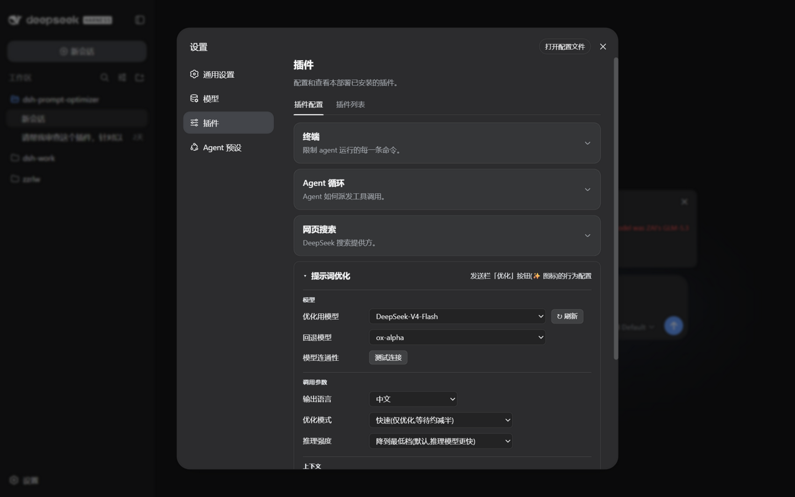

# dsh-prompt-optimizer

[中文](README.md) | **English** | 🐣 [Beginner guide (中文)](README.simple.md)

[](https://github.com/Y1X1n/dsh-prompt-optimizer/actions/workflows/ci.yml)
[](https://www.npmjs.com/package/@y1x1n/dsh-prompt-optimizer)
[](LICENSE)
[](https://github.com/Y1X1n/dsh-prompt-optimizer/releases/latest)
[](https://github.com/Y1X1n/dsh-prompt-optimizer/stargazers)
[](CONTRIBUTING.md)

A DeepSeek Harness plugin that adds an **Optimize** button (✨) next to the composer, one click analyzes and rewrites the prompt draft in your input box, with results **streamed section by section over SSE**. The optimization call reuses the current session's model route by default (read live on every click — switching models in the session takes effect immediately).

- **Host side**: registers two routes, `POST /dsh-prompt-optimizer/optimize` (SSE streaming) and `POST /dsh-prompt-optimizer/test-model` (connectivity probe), and drives `ctx.llm` for the "analyze + rewrite" call.
- **Client side**: injects the button into the `conversation.input.right` slot, the result panel into `conversation.input.dock` (a full-width row above the input card, same family as TodoDock — renders on the new-session screen too and never covers the input box), and a collapsible settings card into `settings.plugin.item`. UI copy follows the DSH interface language (中文 / English).

## Contents

- [Features](#features)
- [Installation](#installation)
  - [From a Release (recommended, no build)](#from-a-release-recommended-no-build)
  - [From source (tarball)](#from-source-tarball)
  - [From GitHub](#from-github)
  - [Uninstall](#uninstall)
- [Compatibility](#compatibility)
- [FAQ](#faq)
- [Verification status](#verification-status)
- [How it works](#how-it-works)
- [Development](#development)
- [Security notes](#security-notes)
- [Contributors](#contributors)
- [License](#license)

> 🐣 **First time using dsh plugins?** See the [beginner guide](README.simple.md) (in Chinese): three steps to install, one click to use.



| | |
|---|---|
|  |  |
|  |  |

## Features

- An **Optimize** button on the right of the composer tool row (disabled while empty, breathing animation while working). During the wait the panel shows the live stage (waiting for model / analyzing / writing the rewrite) with an elapsed-seconds readout; on completion the model badge shows the total duration.
- Reads the current session's provider/model on every click; **analysis and rewrite stream onto the panel** above the input card — no staring at a spinner for the whole generation.
- **Dual optimization strategies**: with no conversation context (fresh session, or context disabled) it rewrites with a **structured template** (role / task / constraints / output format); with context it switches to **distill-intent + polish** — reads the recent conversation, keeps the draft's original framing instead of forcing a template, never re-asks what the context already answers, and never resurfaces **directions you already rejected** (the do-not-enter set).
- **Fidelity discipline** (inspired by Fishsb/dsh-prompt-enhancer): semantic-equivalence floor, traceability (inferences are marked "unless otherwise specified / by default"), a pre-output element-by-element **fidelity self-check** against drift, with the self-check explicitly outranking the length discipline (target under 800 characters for simple tasks — a missing element is worse than verbosity), and few-shot examples to stabilize output style.
- **Lightweight memory chain**: edit our optimized text and click Optimize again, and the previous round's result rides along as a continuity reference (accepted decisions carry over, only your changes are worked on). Same-text retries, cross-session calls, and degraded (non-wellFormed) results never ride (degradation is only judged in full mode — fast mode always counts as compliant); the chain resets the moment you send or close the panel, and it follows the "include context" switch.
- **Slash-command safe**: input like `/goal help me …` optimizes only the body; the command prefix is re-attached on replace — the command word is never rewritten. A bare command with no body (just `/goal`) is rejected up front with a notice instead of being "optimized" into garbage.
- **Context aware**: by default carries the session's recent conversation as reference (**user messages are guaranteed a floor** — agentic sessions produce far more assistant step fragments than user input, and naive recency sampling would crowd out what you actually asked), capped at 8 turns / 1600 chars; the meta-prompt explicitly forbids answering or continuing the context. Empty sessions fall back to the template strategy. Can be disabled in the settings card.
- Result panel: **five-dimension diagnosis** (goal clarity / context / constraints / structure / output spec) + the **full optimized prompt**; actions: **replace the input box** (with **undo**, which auto-invalidates once you edit the replaced text) / copy / re-optimize / close. **The panel closes itself after you send the message or clear the input.**
- **Cancel keeps the content**: press Esc while optimizing and the panel freezes in a cancelled state showing everything generated so far — review it, hit "re-optimize" to continue, or close. In any other state Esc just closes the panel. A client-side **timeout watchdog** (settings timeout + 5s margin) turns a hung Host or black-holed network into an explicit timeout error instead of an endless spinner.
- Panels are session-scoped: switching sessions never leaks an old result into another session's view or input box.
- **Auto-follow scrolling while streaming**: the live view sticks to the bottom as content grows, pauses when you scroll up, and resumes when you return near the bottom.
- All panel styling uses official Harness design tokens (`--dsw-alias-*`); follows light/dark theme automatically.
- Long-draft friendly: the output cap rises with estimated input length by default (full mode ×2 / fast mode ×1.5, capped at 32768); on real truncation the partial result is still shown with a clear notice instead of disappearing.
- Format tolerance: marker variants (e.g. `<<< ANALYSIS >>>`) parse correctly; in full mode, outright non-compliant output degrades gracefully with a warning; in fast mode the result is a single section, so it always counts as compliant whether or not the model emits markers (no warning, memory chain unaffected) — friendly to third-party/free models that skip the marker format — their raw stream is previewed live, character by character, until a marker appears.
- Settings → Plugins → "Prompt Optimizer" card (collapsed by default, click the header to expand; the collapsed header shows a "model · mode" summary; every change can be reverted in one step via "Undo last change" at the bottom — an in-memory stack of the last 20):
  - **Model**: optimization model (**follow the current session** (default), or pin one from the model catalog, provider/model dropdown with manual refresh) / fallback model (automatic failover when the primary route fails before producing anything — the panel badge shows "· fallback", hover to see why) / connectivity ("Test connection", 32-token / 20s capped probe showing the actual route and latency)
  - **Generation parameters**: output language (中文 / English); mode: full (analysis + rewrite) / **fast** (rewrite only, roughly half the output tokens); reasoning effort: clamp to lowest tier (default — dramatically shortens the pre-first-token stall on reasoning models) / follow session; max output tokens (default 8192), timeout (default 120s), temperature (default 0.2, hover for the rationale); auto output-cap toggle (default on)
  - **Context**: include-context toggle (default on): when off, only the draft itself is read — no session history

## Installation

Prerequisite: the `dsh` CLI (an environment where `npx @deepseek-ai/dsh web` works).

### From a Release (recommended, no build)

```sh
# Download y1x1n-dsh-prompt-optimizer.tgz (always points to the latest release), then install the local file
dsh plugin --profile web add ./y1x1n-dsh-prompt-optimizer.tgz
```

Download: https://github.com/Y1X1n/dsh-prompt-optimizer/releases/latest/download/y1x1n-dsh-prompt-optimizer.tgz

### From source (tarball)

```sh
cd dsh-prompt-optimizer
npm install --legacy-peer-deps   # the prepare hook builds lib/ automatically
npm pack                          # produces y1x1n-dsh-prompt-optimizer-<version>.tgz
dsh plugin --profile web add ./y1x1n-dsh-prompt-optimizer-<version>.tgz
```

Then (re)start `dsh web` and open the Web UI — the button appears next to the composer.

> **Windows note**: `dsh plugin add ./directory` goes through pnpm `link:`, which currently misparses the drive-letter colon as a protocol separator and produces a broken symlink (`node_modules/<pkg>` points nowhere), so the plugin never loads. Use the tarball form for local installs; the directory-link form works on macOS/Linux.

### From GitHub

```sh
dsh plugin --profile web add github:Y1X1n/dsh-prompt-optimizer
```

Git installs pull the source; this package self-builds at install time via its `prepare` script (only Node needed, no monorepo). pnpm ≥10 refuses to run build scripts on first install — add the package name to `allowBuilds` in that profile's `pnpm-workspace.yaml` as the terminal prompt suggests, then retry. Pinning a commit is recommended: `github:Y1X1n/dsh-prompt-optimizer#<sha>`.

### Uninstall

```sh
dsh plugin --profile web remove @y1x1n/dsh-prompt-optimizer
```

## Compatibility

- Development baseline: `@deepseek-ai/*` **0.1.0-rc.7** (matching the packages bundled with `npx @deepseek-ai/dsh@0.1.0-rc.7`); verified on the **0.1.0-rc.8** runtime (2026-08-20, Windows, real-profile install + Web routes / client bundle / session-history RPC / end-to-end LLM call), and re-verified on **0.1.1-rc.2** (2026-08-27, Windows: `--dump-config` composition layer, route registration, client bundle all healthy).
- Protocol contract: `/dsh-prompt-optimizer/optimize` returns 400/405/409/413 as plain JSON on pre-check failure and switches to an SSE stream on success (model errors arrive as `error` events); `/dsh-prompt-optimizer/test-model` **always returns HTTP 200** with an `ok` field in the body (a probe is application-level semantics, deliberately not mapped to transport status codes) — integrate against `ok`, not the status code.
- The HTTP carrier service name has drifted between releases (`httpServer` in the npm 0.0.1-rc.x type packages, `webServer` in the 0.1.0-rc.x runtime): the plugin waits on both names via `ctx.inject` with no static hard dependency — if the name changes again, only this plugin's routes fail to register (with a log warning after 10s); the Harness startup is never dragged down.
- Client and Host must be the same version (the SSE protocol is a private contract): after upgrading, restart `dsh web` and refresh the browser.

## FAQ

- **Clicked "Optimize" and nothing happened?** Open the browser console and look for logs starting with `[dsh-prompt-optimizer]`; common causes are no model configured (set up a provider under Settings → Models first), or the upstream slot the panel needs is not ready yet (refresh the page).
- **"No usable model found"?** The session has no routable model selected and no model is pinned in the settings card; fix either one. You can also expand the settings card and hit "Test connection" to confirm the route works.
- **Result truncated?** The panel shows a truncation notice; the auto output cap (on by default) already rises with draft length — if it is still not enough, raise "Max output tokens" in the settings card.
- **Session model change not taking effect?** Every click re-queries the session's current model; if it still looks wrong, check the console for a `session model query failed` warning (the first available route is used as a fallback then). Note: a model pinned in the settings card overrides the session selection.
- **Occasional timeout / RATE_LIMIT failures on optimization?** Transient-error retries are handled by the host at the **provider layer** (dsh 0.1.1+ provider config ships a retry policy covering `RATE_LIMIT / SERVER / TIMEOUT / TRANSPORT / EMPTY_RESPONSE` by default). Tune retry count and backoff under Settings → Models → the provider in question — not the plugin's "timeout" setting, which only bounds a single call's total duration.
- **Can't find the card on the settings page?** 0.3.0's strict enum schema could clash with older settings documents and stop the card from rendering; fixed in 0.3.1 (unknown enum values fall back to defaults). Make sure you are on ≥0.3.1 and refresh.
- **Button still there after uninstall?** Plugin-set changes only take effect after restarting `dsh web`; a page refresh is not enough.

## Verification status

Verified in a real environment (dsh 0.1.0-rc.8 tested + 0.1.1-rc.2 re-verified, Windows — see Compatibility); v0.3.9–0.3.11 were additionally verified end-to-end on a **third-party free model** (openrouter `minimax/minimax-m3:free`, which emits no marker format): both strategies, element-by-element fidelity, `[TODO]` markers, memory chain, and cancel-keeps-content all behave as designed — and this live testing is what surfaced the fast-mode false-positive fixed in v0.3.10/11.

- Composition-layer load: `--dump-config` shows the `# == dsh-prompt-optimizer` layer;
- Host: startup log `[dsh-prompt-optimizer] loaded`; both routes behave correctly across their 400/405/409/413 paths; SSE streaming verified live;
- Client: the bundle is picked up by client-modules, appears in `window.__DSH_BOOT__`, and `/plugins/dsh-prompt-optimizer/client.js` is reachable;
- End to end: a real `ctx.llm` call (DeepSeek route) completes "analysis + rewrite" with correct marker parsing (`wellFormed: true`).
- Automated tests (`npm test`, 62 cases):
  - `test/smoke.mjs`: 28 Host smoke cases (real cordis Context + mocked services: route-resolution priority, empty/malformed config, 400/405/409/413, SSE event flow, max-tokens truncation, timeout, fast mode, reasoning clamp, legacy-settings normalization, connectivity test, fallback chain with fallback-reason passthrough, tool-calls guard, auto output cap, context injection and hard switch, strategy selection, memory-chain injection and truncation, origin fence);
  - `test/prompt.test.mjs`: 13 meta-prompt parsing cases (marker whitespace variants, degradation paths, partial-stream parsing, stream-buffer compaction, token estimation, context payload and budgeting, strategy fork, fidelity rules and examples, memory-chain payload);
  - `test/controller.test.mjs`: 21 client pure-logic cases (SSE frame parsing, frame coalescing, interrupted connections, session-query skipping, undo flow, retry, close-abort, cancel keeping partial output plus its state gate, client timeout watchdog, history extraction filtering and degradation, slash-prefix splitting and bare-command rejection, memory-chain passing and gates, send-to-close decisions, duration recording, user-first context sampling).

## How it works

```
Click "Optimize"
  → Client reads the input draft + the session's model selection (session.models RPC, queried
    live on every click; skipped when a model is pinned in settings — the Host's pinned value wins)
  → POST /dsh-prompt-optimizer/optimize { text, provider, model, reasoningEffort, context?, previous? }
  → Host calls ctx.llm.stream() with the system meta-prompt
    (route resolution: pinned setting → session selection → first available route; an optional
     fallback route fails over on zero-output failure; the output cap rises with estimated input
     tokens by default; optional reasoning clamp / low temperature)
  → text-delta chunks are pushed over SSE and the panel shows "analysis / rewrite" sections live
    (incrementally parsed on <<<ANALYSIS>>> / <<<OPTIMIZED>>> markers, whitespace variants tolerated)
  → the done event carries the final parsed result; a max-tokens finish carries a truncated flag; a fallback adds its reason
  → one click replaces the input box (undoable, slash prefix re-attached) / copy / re-optimize (edits continue from the previous result; same text regenerates fresh)
  → Esc while optimizing = cancel (a cancelled state keeps what was generated); a client-side watchdog guards against an unresponsive Host
```

## Development

```sh
npm install --legacy-peer-deps   # install deps and trigger the build
npm run sync:types               # sync the client type packages (see below)
npm run typecheck                # tsc --noEmit
npm run build                    # produces lib/{index,client,prompt,controller}.js
npm test                         # smoke + prompt + controller suites
```

### About `sync:types`

The upstream monorepo publishes only part of the `@deepseek-ai/*` packages (the rest are `publishConfig: restricted`), so the client type packages' transitive dependencies cannot be installed from npm. `scripts/sync-types.mjs` handles it:

1. Published packages are `npm pack`ed and extracted straight into `node_modules` (bypassing npm's dependency-tree resolution);
2. For unpublished packages (e.g. `dsh-type-meta`), it scans every `.d.ts` reference and generates minimal stub packages (only module resolvability matters under `skipLibCheck`).

These packages only participate in type checking; at runtime everything is provided by the Harness page/process (`react` and `@deepseek-ai/*` are external).

### Directory layout

```
dsh-prompt-optimizer/
├── package.json          # dsh.bundle + dsh.client dual manifest
├── cordis.patch.yml      # composition layer: inserts the Host plugin line
├── src/
│   ├── index.ts          # Host plugin: settings namespace + two HTTP routes + llm call (with fallback chain)
│   ├── prompt.ts         # meta-prompts, marker parsing, token estimation (pure functions)
│   └── client/
│       ├── index.tsx     # Client entry: slot registrations
│       ├── controller.ts # shared state machine for button/panel + SSE consumption (standalone artifact, unit-testable)
│       ├── i18n.ts       # zh/en UI copy, follows the DSH interface language
│       ├── OptimizeButton.tsx   # composer button
│       ├── ResultDock.tsx       # result panel above the input card (live streaming + undo)
│       ├── SettingsCard.tsx     # collapsible settings card
│       └── SparkleIcon.tsx      # hand-drawn ✨ icon
├── scripts/build.mjs     # esbuild: Host ESM + Client lazy-CJS factory + two test artifacts
├── scripts/sync-types.mjs
├── scripts/prompt-probe.mjs  # prompt evidence probe: fires real optimize requests at a running instance (PROBE_ROUTE=provider/model to pin a route)
└── test/                 # smoke.mjs (Host) / prompt.test.mjs / controller.test.mjs
```

## Security notes

- The HTTP routes are registered on dsh's own web server, which listens on `127.0.0.1` by default. If you expose dsh to your LAN (`0.0.0.0`), this plugin's optimize endpoint becomes callable from the LAN too — it consumes your configured model quota; be aware.
- Both routes enforce an **origin fence**: requests carrying an `Origin` header (browser POSTs always do) must match `Host`, and `Host` must be a loopback address or the machine's actual local address — cross-site forged requests (CSRF) and DNS rebinding get a 403; command-line calls without `Origin` are unaffected.
- The plugin holds no API keys: every model call goes through the Harness-configured `ctx.llm` routes.

## Contributors

Thanks to the following contributors for improvements to this project (see the [contributing guide](CONTRIBUTING.md)):

- [@ruijiaang-lab](https://github.com/ruijiaang-lab) — contributing guide ([#2](https://github.com/Y1X1n/dsh-prompt-optimizer/pull/2))

## License

MIT
